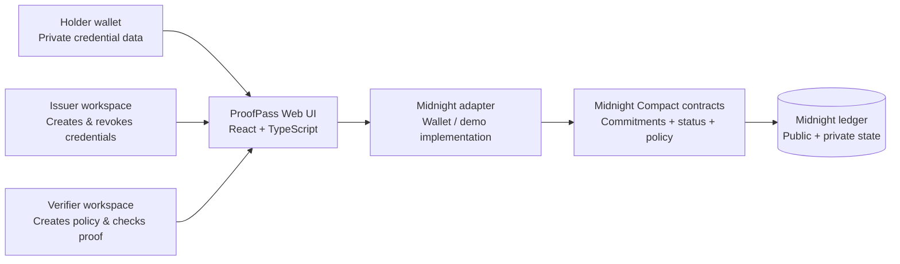
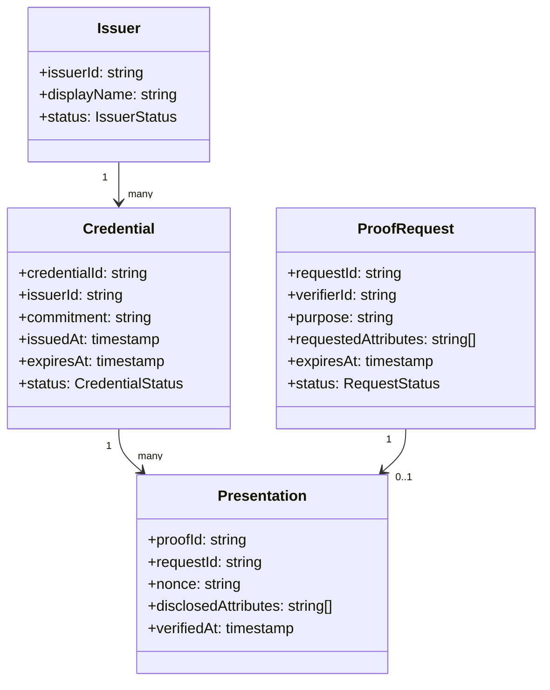
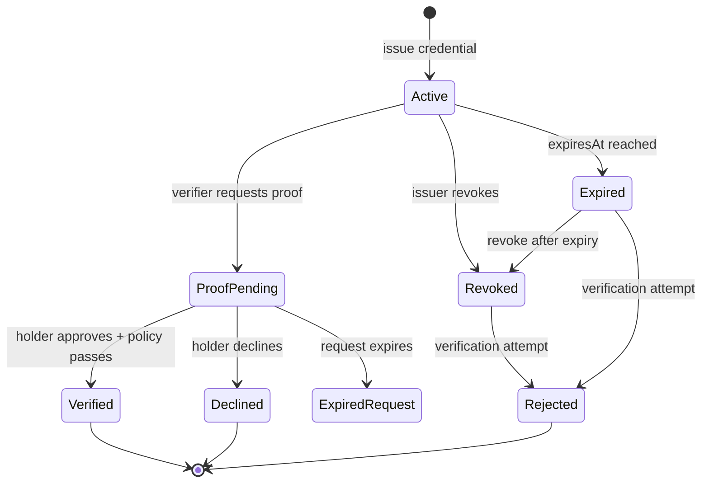
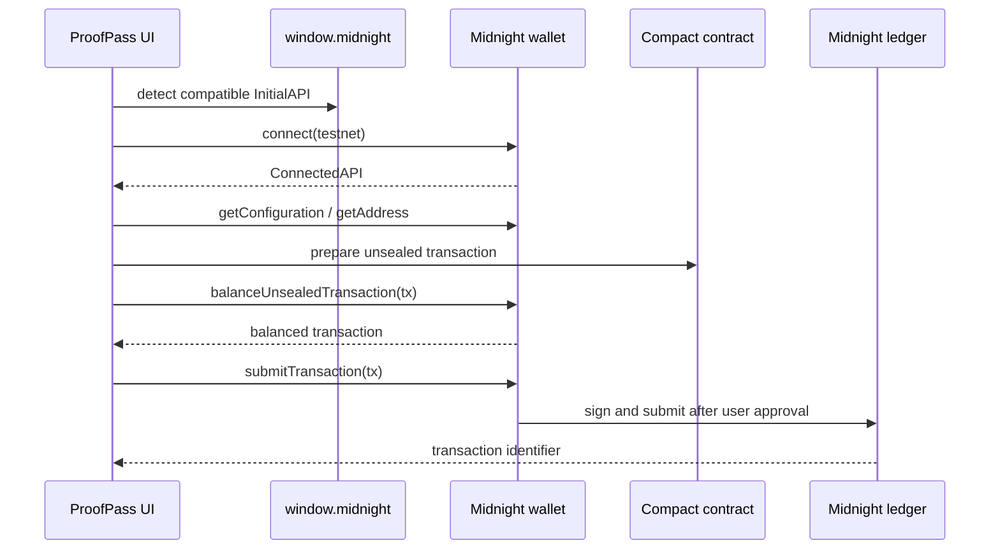

# Technical Architecture Document

## ProofPass

**Versi:** 0.1 — Buildathon MVP  
**Status:** Draft for implementation  
**Target:** ProofPass responsive web application for Midnight Buildathon

---

## 1. Architecture Summary

ProofPass menggunakan arsitektur **privacy-preserving credential verification** yang memisahkan tiga jenis data:

1. **Private credential payload**, yang hanya berada pada holder atau pihak berwenang.
2. **Public verification metadata**, seperti commitment, issuer identifier, status, timestamp, dan expiry yang memang perlu diperiksa.
3. **Presentation proof**, yaitu hasil pembuktian terkontrol yang hanya mengungkap atribut yang diminta verifier.

Frontend terdiri dari tiga workspace yang berbagi komponen desain: Holder, Issuer, dan Verifier. Pada MVP, frontend menyediakan demo adapter agar alur dapat dipresentasikan tanpa menunggu seluruh wallet integration tersedia. Adapter wajib diberi label `Demo mode` dan tidak boleh disamakan dengan transaksi on-chain production.

## 2. System Context



## 3. Design Principles

| Principle | Technical decision |
|---|---|
| Data minimization | Raw personal data tidak ditulis ke public ledger. |
| Explicit trust boundary | UI, adapter, contract, dan ledger dipisahkan dengan interface yang jelas. |
| Testable privacy | Setiap proof policy dapat diuji pada valid, expired, revoked, dan tampered inputs. |
| Replaceable adapter | Demo adapter dapat diganti implementasi wallet tanpa mengubah presentational UI. |
| Deterministic state | Semua status berasal dari event atau mutation yang dapat dilacak. |
| Graceful degradation | Wallet disconnected dan transaction error memiliki state UI yang dapat dipulihkan. |

## 4. Logical Components

### 4.1 Presentation layer

React pages menangani route dan layout. Reusable components menangani buttons, badges, cards, sheet, table, tabs, dan toasts. Page tidak boleh memuat logika contract secara langsung.

### 4.2 Application state layer

State layer mengelola selected role, current workspace, proof request status, optimistic UI state, dan toast notification. Pada static MVP, state berada di React context atau local state. Pada full-stack version, state ini akan dipindahkan ke typed query layer.

### 4.3 Domain service layer

Domain services mengekspos operasi berikut:

- `issueCredential(input)`
- `revokeCredential(credentialId, reason)`
- `createProofRequest(policy)`
- `approveProof(requestId, selectedAttributes)`
- `declineProof(requestId)`
- `verifyPresentation(presentation)`
- `getCredentialStatus(credentialId)`

Service tidak mengembalikan raw private payload kepada verifier. Service mengembalikan typed result dengan disclosure scope yang eksplisit.

### 4.4 Midnight adapter

Adapter adalah boundary untuk integrasi Compact contract dan wallet. Implementasi production harus menghubungkan operasi domain dengan SDK Midnight. Implementasi demo dapat mengembalikan deterministic mock transaction hash dan status transition.

```ts
export type CredentialStatus = "active" | "expired" | "revoked";

export type ProofResult = {
  proofId: string;
  status: "verified" | "rejected";
  disclosedAttributes: string[];
  transactionId?: string;
};

export interface MidnightAdapter {
  getNetworkStatus(): Promise<{ network: string; connected: boolean }>;
  issueCredential(input: IssueCredentialInput): Promise<{ credentialId: string }>;
  revokeCredential(input: RevokeCredentialInput): Promise<{ transactionId: string }>;
  createProofRequest(input: CreateProofRequestInput): Promise<{ requestId: string }>;
  approveProof(input: ApproveProofInput): Promise<ProofResult>;
  verifyProof(input: VerifyProofInput): Promise<ProofResult>;
}
```

## 5. Deployment View

### MVP static frontend

- Vite build menghasilkan static assets.
- Client-only routing menggunakan Wouter.
- Demo data berada pada frontend state.
- Tidak ada secret atau private key pada browser bundle.
- Contract integration dapat disimulasikan melalui adapter interface.

### Production evolution

- Upgrade ke `web-db-user` apabila membutuhkan authentication, organization account, persistent audit events, or server-side secrets.
- Backend menjadi BFF untuk typed APIs, tetapi private credential payload tetap dienkripsi dan tidak disimpan tanpa alasan yang jelas.
- Wallet signing tetap dilakukan pada wallet boundary, bukan pada server.

## 6. Data Classification

| Data | Klasifikasi | Lokasi yang diizinkan | Catatan |
|---|---|---|---|
| Legal name | Private | Holder wallet atau encrypted vault | Tidak diperlukan verifier untuk status kelulusan. |
| Credential attribute | Private by default | Holder wallet | Hanya atribut yang dipilih yang boleh masuk presentation. |
| Credential commitment | Public verification metadata | Ledger | Tidak mengungkap payload asli. |
| Issuer identifier | Public | Ledger dan UI | Dibutuhkan untuk trust lookup. |
| Credential status | Public or provable state | Ledger | Active, expired, revoked. |
| Proof request purpose | Shareable metadata | Verifier dan holder | Harus terlihat sebelum approval. |
| Presentation proof | Controlled disclosure | Holder ke verifier | Memakai nonce dan expiry untuk mencegah replay. |
| Raw audit payload | Restricted | Tidak boleh di public activity | Activity hanya menampilkan event minimum. |

## 7. Domain Model



## 8. Compact Contract Boundaries

Nama modul berikut adalah boundary konseptual. Nama fungsi final harus disesuaikan dengan API Compact dan SDK Midnight yang tersedia pada saat implementasi.

### 8.1 CredentialRegistry

Tanggung jawab:

- Mendaftarkan issuer.
- Menyimpan issuer status.
- Memastikan hanya issuer terdaftar yang dapat menerbitkan credential.

Invariants:

- `issuerId` unik.
- Issuer revoked tidak dapat menerbitkan credential baru.

### 8.2 CredentialVault

Tanggung jawab:

- Membuat credential commitment.
- Mengaitkan commitment dengan issuer dan holder authorization.
- Menetapkan issued-at dan expires-at.

Invariants:

- Credential identifier unik.
- Payload private tidak disimpan sebagai plain public state.
- Issued credential tidak dapat dimodifikasi tanpa menghasilkan state transition baru.

### 8.3 RevocationRegistry

Tanggung jawab:

- Mengubah credential active menjadi revoked.
- Menyediakan status yang dapat digunakan oleh verify policy.

Invariants:

- Hanya issuer atau revocation authority yang sah dapat revoke.
- Credential revoked tidak dapat kembali menjadi active pada jalur MVP.

### 8.4 ProofPolicy

Tanggung jawab:

- Menerima policy verifier.
- Memeriksa credential commitment, issuer status, expiry, revocation, nonce, dan attribute predicate.
- Menghasilkan presentation yang hanya berisi disclosure scope yang disetujui.

Invariants:

- Proof harus mempunyai request ID dan nonce.
- Proof expired tidak dapat digunakan kembali.
- Atribut di luar consent tidak boleh masuk result.

## 9. State Machine



## 10. Request / Response Contracts

```ts
export type CreateProofRequestInput = {
  verifierId: string;
  purpose: string;
  requestedAttributes: Array<"completion_status" | "cohort" | "issuer">;
  expiresAt: string;
};

export type ApproveProofInput = {
  requestId: string;
  selectedAttributes: string[];
  consentVersion: string;
  nonce: string;
};

export type VerifyProofInput = {
  proofId: string;
  requestId: string;
  nonce: string;
};
```

Response harus membedakan `rejected` dan `error`. `rejected` berarti proof diperiksa tetapi tidak memenuhi policy. `error` berarti sistem tidak dapat menyelesaikan operasi, misalnya wallet disconnected atau network timeout.

## 11. Threat Model

### Threats

1. Verifier meminta atribut lebih banyak daripada yang dibutuhkan.
2. Attacker mengubah atribut lokal sebelum proof dibuat.
3. Attacker melakukan replay terhadap proof lama.
4. Issuer tidak berwenang menerbitkan credential.
5. Activity feed tanpa sengaja menampilkan private attributes.
6. User salah memahami demo adapter sebagai transaksi production.

### Mitigations

| Threat | Mitigasi |
|---|---|
| Over-disclosure | Policy memiliki allow-list atribut dan UI consent wajib. |
| Tampering | Commitment dan integrity check di contract. |
| Replay | Nonce unik, request ID, expiry, dan used-proof state. |
| Unauthorized issue | Issuer registry dan authorization check. |
| Metadata leak | Activity view hanya menyimpan proof ID, purpose, status, dan time. |
| Misleading demo | Persistent `Demo mode` indicator dan copy yang jelas. |

## 12. Frontend Module Structure

```text
client/src/
  App.tsx
  index.css
  pages/
    Home.tsx
    NotFound.tsx
  components/
    ui/                    # shadcn primitives
    ProofPassShell.tsx     # future shared application shell
    StatusBadge.tsx
    CredentialCard.tsx
    ProofRequestCard.tsx
    PrivacyScore.tsx
  hooks/
    useProofPassState.ts
    useReducedMotion.ts
  lib/
    adapter.ts
    mock-data.ts
    types.ts
```

Pada versi demo, sebagian besar UI dapat dirender dari `Home.tsx`. Ketika implementasi berlanjut, komponen di atas harus diekstrak agar pages tidak menjadi monolith.

## 13. Observability

MVP mencatat event non-sensitif berikut pada console atau local activity state: `proof_request_opened`, `proof_approved`, `proof_declined`, `credential_revoked`, `verification_failed`. Event tidak boleh memuat raw credential payload atau legal name.

Production version perlu structured logs untuk latency, adapter errors, and transaction status. Data observability harus dianonimkan dan dipisahkan dari audit proof.

## 14. Testing Strategy

### Unit tests

- Credential status transition.
- Revocation authorization.
- Policy allow-list.
- Expiry validation.
- Nonce uniqueness.
- Disclosure result.

### Integration tests

- Issuer issue → holder receives → verifier requests → holder approves → verifier verifies.
- Revoke → verify returns rejected.
- Expire → verify returns rejected.
- Wallet disconnected → UI recovery state.

### UI tests

- Keyboard navigation pada sidebar dan modal.
- Mobile navigation drawer.
- Approval modal focus trap.
- Toast success dan error.
- Reduced motion behavior.

### Demo test script

1. Open overview.
2. Open a pending request.
3. Inspect “what will be shared”.
4. Approve the proof.
5. Confirm status changed to approved.
6. Open Credentials.
7. Revoke a credential in issuer view.
8. Verify the next proof is rejected.

## 15. Architecture Decision Records

### ADR-001: Static frontend untuk Wave 1

**Decision:** Mulai dari static frontend dengan adapter boundary.  
**Reason:** Memungkinkan UI, state model, dan pitch diuji lebih cepat tanpa menyimpan secret server-side.  
**Trade-off:** Belum memiliki persistence dan authentication production.

### ADR-002: Sidebar application shell

**Decision:** Gunakan sidebar persisten untuk workspace internal.  
**Reason:** ProofPass memiliki lima area utama dan membutuhkan orientasi konstan.  
**Trade-off:** Pada mobile harus diganti dengan drawer.

### ADR-003: Demo adapter diberi label eksplisit

**Decision:** UI menampilkan “Demo mode” hingga wallet adapter production aktif.  
**Reason:** Menjaga komunikasi jujur di depan juri dan menghindari klaim keamanan yang belum terbukti.

## 16. Delivery Plan

| Milestone | Deliverable |
|---|---|
| M0 | PRD, architecture, visual direction, UI shell |
| M1 | Credential list, proof request approval, activity feed |
| M2 | Midnight adapter interface dan Compact contract skeleton |
| M3 | Revocation, expiry, test matrix, README |
| M4 | Demo video, slide deck, accessibility and responsive hardening |

## 17. Open Technical Decisions

1. Versi Compact dan SDK yang ditetapkan oleh Midnight untuk Wave 1.
2. Model penyimpanan private state pada wallet holder.
3. Apakah verifier menerima presentation melalui QR, deep link, atau in-app request.
4. Model issuer trust untuk deployment setelah Buildathon.

## Referensi

[1]: /home/ubuntu/proofpass-dashboard/PRD.md "ProofPass product requirements document"

[2]: /home/ubuntu/midnight_buildathon_ideas.md "ProofPass buildathon concept report"

[3]: https://midnight.network "Midnight Network — Privacy-First Blockchain Platform"

[4]: https://www.w3.org/WAI/standards-guidelines/wcag/ "Web Content Accessibility Guidelines"

[5]: https://www.apache.org/licenses/LICENSE-2.0 "Apache License 2.0"


## 18. Wallet Connector Architecture

ProofPass uses the official Midnight DApp Connector API boundary. Wallet extensions inject one or more initial APIs under `window.midnight`. The application detects compatible entries, filters by supported API major version, and connects using `initialApi.connect(networkId)`.

The implementation is isolated in `client/src/lib/midnightWallet.ts`. The adapter currently exposes detection, connection, configuration, address, dust balance, transaction balancing, and transaction submission. It does not hold keys. The wallet retains custody and performs user confirmation.



A missing wallet is an explicit product state. The UI offers an install path and does not label demo state as a real connection. A wallet connection to an unexpected network is rejected by the adapter.

## 19. Role Workspace Boundaries

Issuer and Verifier are separate presentation workspaces over the same domain adapter. The Issuer workspace owns credential registry actions. The Verifier workspace owns proof policy authoring. Neither workspace receives private keys.

The current static build uses deterministic demo data for registry and policy screens. The wallet boundary is real and ready to receive Compact transaction payloads. The next integration step is wiring compiled contract artifacts into the `MidnightAdapter` methods without changing the role UI.

## 20. Theme and Motion Architecture

Theme state is managed by the existing `ThemeProvider` with `switchable` enabled. The provider persists the selected theme in `localStorage` and toggles the `dark` class on the document root. CSS semantic tokens are overridden in `.dark`, allowing components to retain the same class names across themes.

Consent modal motion is implemented as a staged transform and opacity sequence. The sequence is presentation-only and cannot change approval state. Approval remains a single explicit user action that invokes the domain handler.

## 21. Security Notes for Wallet Integration

The UI must treat wallet name, icon, RDNS, and API version as untrusted extension input. Wallet icons are rendered only as image resources if displayed. The app should surface duplicate or suspicious providers in a future wallet-selection dialog rather than silently choosing among ambiguous providers.

The current auto-selection behavior chooses the first compatible provider because the buildathon demo expects a single Lace-style provider. Before production, replace that behavior with a user-facing wallet picker whenever more than one compatible provider is detected.

## 22. Updated Delivery Plan

| Milestone | Deliverable |
|---|---|
| M5 | Official `window.midnight` detection and testnet connection boundary |
| M6 | Issuer workspace for registry health and credential actions |
| M7 | Verifier workspace for purpose-bound proof policy authoring |
| M8 | Persistent dark mode and animated consent disclosure sequence |
| M9 | Compiled Compact artifact integration and end-to-end transaction tests |

## 23. References

[6]: https://docs.midnight.network/guides/react-wallet-connect "Create a React wallet connector"

[7]: https://raw.githubusercontent.com/midnightntwrk/midnight-dapp-connector-api/main/README.md "Midnight DApp Connector API README"

[8]: https://raw.githubusercontent.com/midnightntwrk/midnight-dapp-connector-api/main/docs/api/_media/SPECIFICATION.md "Midnight DApp Connector API specification"

[9]: https://github.com/midnightntwrk/midnight-wallet-dapp "Midnight Wallet dApp reference implementation"


## 20. Final Runtime Integration Decisions

The wallet boundary is provider-selective. The UI never silently chooses a provider when multiple Midnight DApp Connector APIs are injected. It presents provider metadata, requests the explicit target network, and stores only public wallet metadata after a successful connection. The complete public address is persisted for deduplication while the UI uses a shortened representation for display.

The fullstack persistence boundary is implemented with Drizzle and protected tRPC procedures. User-scoped tables cover `issuers`, `credentials`, `walletConnections`, `proofRequests`, and `verifications`. The issuer registry query returns only rows associated with the authenticated user, and all issuer, wallet, proof, and verification mutations require the authenticated context. No private key, seed phrase, raw credential payload, or private attribute is stored by these procedures.

The production contract adapter is implemented in `server/contractAdapter.ts`. It reads `MIDNIGHT_COMPACT_MODULE_PATH`, `MIDNIGHT_COMPACT_ASSETS_PATH`, `MIDNIGHT_COMPACT_CONTRACT_TAG`, and `MIDNIGHT_NETWORK_ID`; validates that the generated module and compiled assets are readable; imports the generated `Contract`; and constructs a real Midnight.js `CompiledContract` through `make`, `withWitnesses` or `withVacantWitnesses`, and `withCompiledFileAssets`. Missing artifacts produce an explicit unavailable state and cannot be represented as a successful on-chain transaction.

The frontend `client/src/lib/midnightContract.ts` mirrors this boundary for configured browser-delivered generated modules. It validates the generated export and prepares a typed circuit request descriptor, but it does not claim that a transaction was submitted. Actual submission remains dependent on a configured provider, wallet approval, and a returned transaction result.
